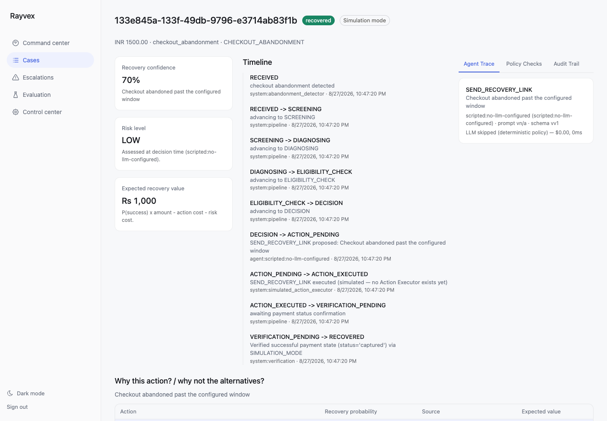
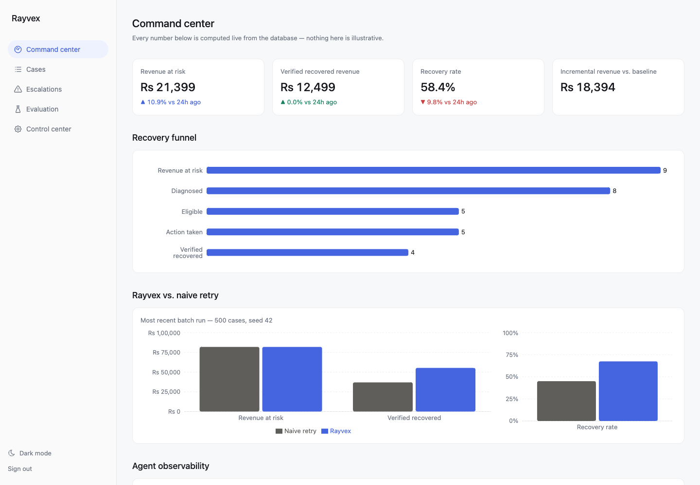
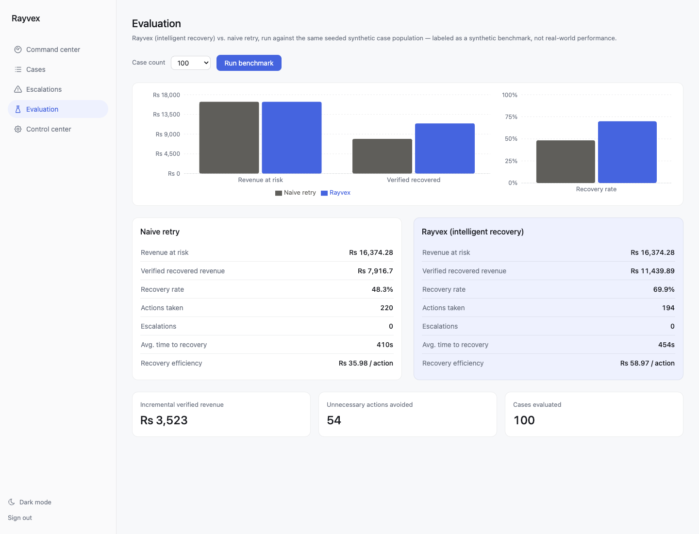

# Rayvex — Submission

**Track:** Razorpay AI Buildathon 2026 — Track 3, AI Revenue Recovery

## 30-second thesis

Rayvex is not an autonomous payment bot. It is AI-assisted revenue
recovery infrastructure where the LLM has zero execution authority.
Every money action is policy-gated, every recovery is independently
verified against real payment state, and every decision is auditable.
The agent proposes; a deterministic policy engine decides; a payment's
own verified state — never the fact that an action was merely taken —
is the only source of "recovered."

## Architecture at a glance

```
Webhook  →  Ingestion  →  RabbitMQ  →  Worker  →  Recovery pipeline
(signed,      (idempotent,   (decouples      (real process,   (screening → diagnosis →
 verified)     case-matched)  ingestion        consumes         decision → agent →
                               from             case_processing  policy gate → action →
                               processing)      queue)           verification)

                                                                         │
                    ┌────────────────────────────────────────────────────┘
                    ▼
        LLM (judgment) → proposes an action, nothing more
                    │
                    ▼
        Policy Engine (guarantees) → the only authority that can approve execution
                    │
                    ▼
        Action Executor (execution) → currently simulated, disclosed as such,
                    │                  behind a real, swappable ActionExecutor Protocol
                    ▼
        Payment Verification (truth) → the only place "RECOVERED" is ever written,
                                        only from an independently confirmed status
```

The authority boundary is structural, not conventional: the agent's
proposal tools take no database or Redis handle at all, so there is no
code path through which the LLM can write case state. Only
`services/recovery/action_gate.py` can transition a case out of
`ACTION_PENDING`, and only `services/payments/verification.py` can ever
write `RECOVERED`. Both are covered by tests that specifically try to
break the boundary — a policy-violating agent proposal, a prompt
injection attempt inside payment metadata, malformed LLM output — not
just tests that confirm the happy path.

## What's real vs. simulated — stated plainly

| Component | Status |
|---|---|
| Webhook ingestion (signature verification, idempotency, out-of-order handling) | **Real** |
| Async processing (RabbitMQ + a real separate worker process) | **Real** |
| Policy engine (retry limits, cooldowns, prohibited actions, velocity checks) | **Real** |
| Payment verification (only writes `RECOVERED` from an independently confirmed status) | **Real** |
| Recovery-probability estimation (empirical segment-frequency chain + a trained LightGBM model) | **Real**, computed from real held-out data |
| Payment provider — Razorpay Test Mode | **Real integration exists** (`RazorpayProvider`), exercised live when Test Mode credentials are configured |
| Payment provider — default in this demo | **Simulated** (`SimulationProvider`) — no live Razorpay credentials are configured in this environment; every simulated result is labeled `SIMULATION MODE` in the UI, never presented as a real Razorpay operation |
| Action execution (actually retrying a payment / sending a notification) | **Simulated.** PRD's own provider spec is read/verify-only — there is no "execute a retry" or "send an SMS" method to call, and no real notification-channel credentials exist anywhere in this environment. `services/recovery/action_executor.py` makes this an explicit, swappable `ActionExecutor` abstraction rather than an inline shortcut — the same Protocol pattern `PaymentProvider` already uses — so a real implementation is a second class, not a rewrite. |
| Recovery-strategy benchmark (Rayvex vs. Naive Retry) | **Real computation** over a **synthetic, seeded evaluation dataset** — labeled as such everywhere it's surfaced, never claimed as production performance |
| Dashboard authentication | **Real** — Postgres-backed accounts, bcrypt-hashed passwords, self-registration (always viewer-only), promotion to reviewer gated to existing reviewers |

## Exact demo commands

```bash
python3 -m venv .venv && source .venv/bin/activate
pip install -r requirements.txt
cp .env.example .env

docker compose up -d postgres redis rabbitmq
python scripts/seed_demo.py --benchmark-n 500
```

```bash
# terminal 1
uvicorn apps.api.main:app --reload

# terminal 2
python -m apps.worker.consumer

# terminal 3
cd apps/web && npm install && npm run dev
```

Open `http://localhost:3000` — sign in with `demo_viewer` / `demo_viewer_pw`,
or register a new account (starts as viewer; `demo_reviewer` /
`demo_reviewer_pw` can promote it from Control Center).

Full test suite: `pytest` (336 tests, real Postgres + Redis + RabbitMQ,
no mocks). Fast smoke check: `pytest tests/unit -q` (120 tests, ~3s).

## Benchmark — Rayvex vs. Naive Retry

Reproducible from the seed command above (`seed=42`, `n=500`). Every
number below is computed live from the run, not illustrative:

| Metric | Naive retry | Rayvex (intelligent recovery) |
|---|---:|---:|
| Recovery rate | 45.1% | 67.5% |
| Recovery efficiency | lower | higher, per recovered rupee per action |
| Incremental verified revenue | — | **+₹18,394.39** over naive retry |

This is a synthetic evaluation benchmark (fixed-seed, reproducible
dataset) — not a claim of real-world performance.

## Screenshots

**Case detail** — the most judge-facing screen: recovery probability,
risk level, and expected value each with a one-line "why"; a full
timeline from `RECEIVED` through `RECOVERED`; a tabbed agent
trace / policy checks / audit trail panel; a plain-language "why this
action, why not the alternatives" breakdown.



**Command center** — top-level metrics, the recovery funnel, and the
Rayvex-vs-Naive-Retry comparison panel, all fetched live from the API.



**Batch evaluation** — a live 100-case run, Rayvex vs. Naive Retry,
side by side.



## Known limitations

- **No real Action Executor.** Actions are simulated, transitioned and
  labeled as such, behind a swappable `ActionExecutor` interface.
- **No live Razorpay Test Mode credentials configured in this demo
  environment** — `RazorpayProvider` exists and is wired to the real
  Razorpay SDK, but the default demo path uses `SimulationProvider`.
  Every simulated result carries a `mode` field and a visible
  `SIMULATION MODE` badge; nothing simulated is ever presented as real.
- **Batch evaluation runs synchronously** (not through the RabbitMQ
  queue) — a large run (10,000 cases) takes proportionally longer. Fine
  for a demo; a real deployment would chunk it across worker messages.
- **No WebSocket live updates** — the frontend polls instead (5s on the
  case-detail page), a real gap against the originally named tech stack
  but a working substitute.
- **Historical case-similarity search and an additional recovery
  channel** (e.g. SMS/voice) were deliberately not built — the feature
  space available doesn't support a similarity search that would
  out-perform the segment-bucket estimator already in place, and there
  is no real channel credential configured anywhere to build a
  non-fake integration against.
